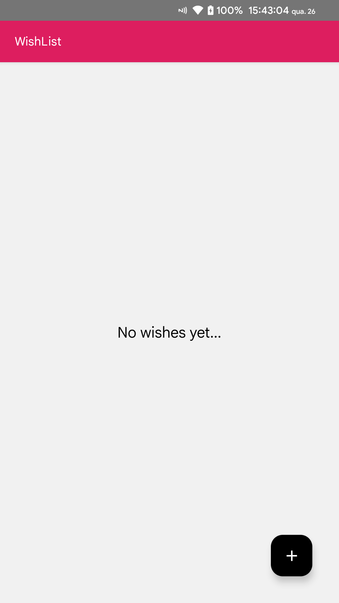
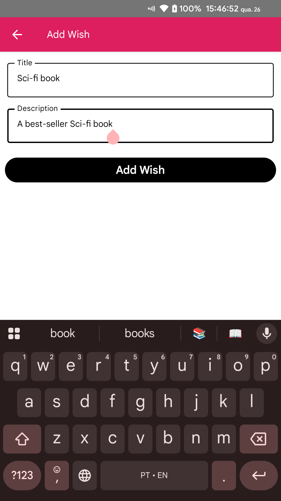
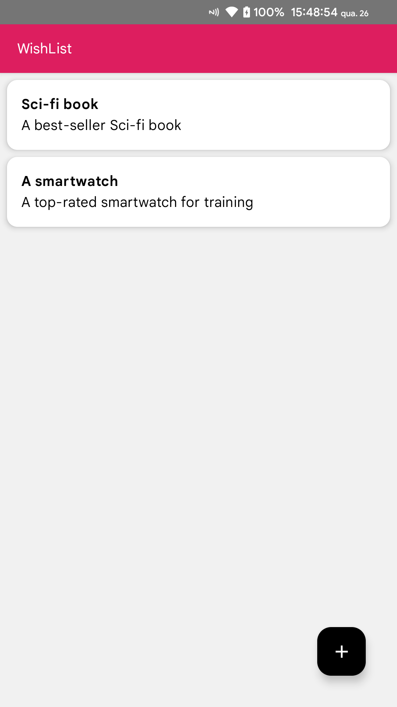
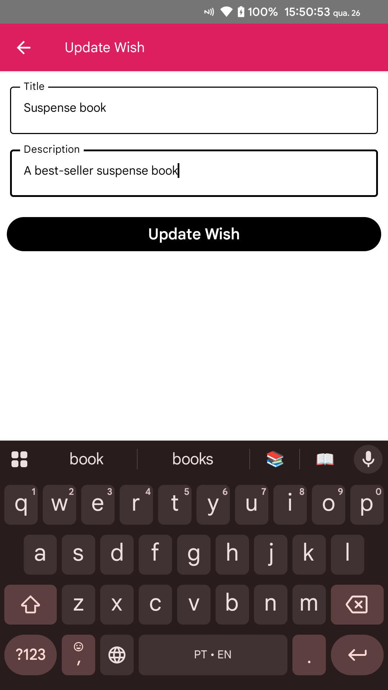

# MyWishList
Aplicativo Android de desejos/metas

### Objetivo
Cadastrar e visualizar os desejos/metas que o usuário adicionar, mantendo salvos localmente

### Funcionalidades
- Adicionar desejo
- Remover desejo
- Visualizar desejos adicionados

### Linguagem / Tecnologia utilizada
- Kotlin - Jetpack Compose
- Room Database

### Screenshots
  
 
